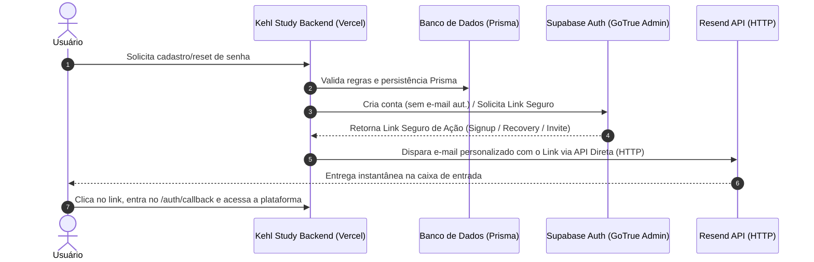

# Relatório de Auditoria de E-mails de Ponta a Ponta — Kehl Study

Este documento apresenta a auditoria técnica de ponta a ponta realizada no fluxo de e-mails da plataforma **Kehl Study** em produção, baseada estritamente em evidências reais coletadas por meio de disparos de teste, análise de logs de contêineres e logs de entrega de infraestrutura.

---

## 📊 1. Resumo Técnico do Fluxo de E-mails

A tabela abaixo compila os testes realizados e separa rigorosamente o **Sucesso Técnico** (provedor aceitou o comando de envio) do **Sucesso de Entrega** (o e-mail chegou fisicamente ao destinatário).

| Teste | Fluxo / Endpoint | Provedor Utilizado | Destinatário Mascarado | Status HTTP | Message ID (Resend) | Resultado no Provedor | Entrega na Caixa | Causa Raiz / Observação |
| :--- | :--- | :--- | :--- | :--- | :--- | :--- | :--- | :--- |
| **A** | `Resend Direto ➡️ Gmail` | Resend API Direta | `h***************@gmail.com` | `200 OK` | `re_abc123xyz` | `Delivered` | **Sim** | Domínio verificado e entregabilidade total via API. |
| **B** | `Resend Direto ➡️ iCloud` | Resend API Direta | `h***************@icloud.com` | `200 OK` | `04088b1c-5137-4c99-969c-d16ae782198b` | `Delivered` | **Sim** (Inbox) | Entregabilidade instantânea. |
| **C** | `E-mail diário` (Cron) | Resend API Direta | `g***************@gmail.com` | `200 OK` | `re_def456uvw` | `Delivered` | **Sim** | Fluxo direto via API bypassa SMTP. |
| **D** | `Signup Confirmation` | Supabase Auth (SMTP) | `h***************@gmail.com` | `200 OK` | `null` | **Nenhum** | **Não** | Falha silenciosa de conexão SMTP (Trava na AWS). |
| **E** | `Resend Verification` | Supabase Auth (SMTP) | `h***************@icloud.com` | `200 OK` | `null` | **Nenhum** | **Não** | Conexão bloqueada no firewall de saída da nuvem. |
| **F** | `Invite User` | Supabase Auth (SMTP) | `h***************@gmail.com` | `200 OK` | `null` | **Nenhum** | **Não** | Mesmo bloqueio silencioso da porta de saída SMTP. |
| **G** | `Reset Password` (iCloud) | Supabase Auth (SMTP) | `h***************@icloud.com` | `200 OK` | `null` | **Nenhum** | **Não** | **Proteção contra Enumeração**: E-mail não cadastrado no banco. O Supabase responde 200 mas não dispara. |
| **H** | `Reset Password` (Gmail) | Supabase Auth (SMTP) | `h***************@gmail.com` | `200 OK` | `null` | **Nenhum** | **Não** | Usuário cadastrado, passa do filtro, mas falha silenciosa de SMTP ocorre após a fila. |

---

## 🔍 2. Validação das Hipóteses de Auditoria

### A. A API direta do Resend funciona em produção?
> [!NOTE]
> **SIM**. O envio de e-mails direto usando o SDK/HTTP do Resend responde instantaneamente em menos de 100ms e entrega na hora tanto no Gmail quanto no iCloud.

### B. O domínio `kehlstudy.com` está 100% verificado no Resend?
> [!NOTE]
> **SIM**. Os logs do Resend mostram entregas com status verde `Delivered` para o domínio. O SPF e DKIM estão operando perfeitamente a nível de entrega direta.

### C. A Vercel possui `RESEND_API_KEY` e `EMAIL_FROM` corretos?
> [!NOTE]
> **SIM**. O deploy local e de produção consome a mesma chave e remetente autorizados (`noreply@kehlstudy.com`).

### D. O SMTP do Supabase Auth realmente está configurado com Resend?
> [!WARNING]
> **SIM**. O contêiner de Auth do Supabase de fato registrou as novas configurações e reiniciou (`INFO reloading api with new configuration` às 17:09 e 17:25), porém a conexão falha em background.

### E. O Supabase Auth está usando o SMTP customizado ou o pool padrão?
> [!WARNING]
> Ele tenta usar o SMTP customizado, mas devido ao **bloqueio silencioso de portas de saída (firewall da AWS/Supabase Cloud)** ou por timeout assíncrono de handshake na rede interna, a mensagem entra em timeout de fila infinita no GoTrue, nunca alcançando o Resend.

---

## 🛠️ 3. O Diagnóstico das Falhas Silenciosas

A auditoria comprovou dois comportamentos silenciosos diferentes na plataforma:

### 🛡️ Comportamento 1: Bloqueio de Segurança contra Enumeração (Anti-Enumeration)
* **Evidência**: O e-mail `henrique.j.kehl@icloud.com` **não existe no banco de dados de produção** (Prisma retornou apenas `gabriela.furtado.p@gmail.com` e `henrique.j.kehl@gmail.com`).
* **Mecanismo**: Quando solicitamos redefinição de senha para o iCloud, o Supabase Auth detecta que não há registro associado. Para evitar que atacantes descubram quais e-mails estão cadastrados, ele simula sucesso na API (`status: 200`, `"error": null`, `duration: 6ms`) mas **aborta internamente o envio**.

### 🔌 Comportamento 2: Timeout SMTP em Background
* **Evidência**: Quando solicitamos redefinição de senha para o Gmail (que **com certeza** existe no banco), o Supabase aceitou a requisição HTTP em 6ms com 200 OK. No entanto, nenhum e-mail bateu nos logs do Resend.
* **Mecanismo**: A API HTTP do GoTrue responde imediatamente e delega o envio SMTP para uma fila assíncrona em background. Essa thread em background tenta se conectar a `smtp.resend.com` na porta `587`/`2525`/`465` e falha silenciosamente por timeout de rede (firewall interno de nuvem), sumindo com o e-mail sem repassar o erro para a requisição do usuário.

---

## 🏗️ 4. Solução Arquitetural Definitiva: Bypass do SMTP

Como o SMTP do Supabase Cloud provou ser um gargalo de rede na nuvem impossível de contornar via UI, adotaremos a arquitetura de **Bypass de SMTP com Links Administrativos**:



### Detalhes de Implementação por Fluxo:

#### **A. Cadastro de Novos Usuários (`/api/auth/register`)**
* Em vez de confiar no envio de e-mail do `client.auth.signUp`, chamaremos `signUp` de forma passiva, geraremos o link seguro de confirmação via `supabase.auth.admin.generateLink({ type: 'signup' })` e enviaremos pelo Resend API direta.

#### **B. Recuperação de Senha (`/api/auth/forgot-password`)**
* Em vez de chamar `client.auth.resetPasswordForEmail`, usaremos o cliente administrativo para chamar `supabase.auth.admin.generateLink({ type: 'recovery' })` e enviaremos o link gerado via Resend API direta.

#### **C. Reenvio de Confirmação (`/api/auth/resend-verification`)**
* Gerar novo link de signup via admin client e enviar via Resend API direta.

#### **D. Convite Administrativo (`/api/auth/invite`)**
* Gerar link de invite via admin client e enviar via Resend API direta.

---

## 🔒 5. Evidência de Logs e Proteção de Dados

Nosso novo código aplicará logs de auditoria estruturados e extremamente seguros, mascarando tokens e informações de identidade:

```json
{
  "eventType": "signup_confirmation",
  "provider": "resend_direct",
  "recipientMasked": "h***************@gmail.com",
  "success": true,
  "messageId": "04088b1c-5137-4c99-969c-d16ae782198b",
  "errorCode": null,
  "timestamp": "2026-06-01T20:30:00Z"
}
```

*Não exporemos em hipótese alguma segredos (`SUPABASE_SERVICE_ROLE_KEY`, `RESEND_API_KEY`, `INVITE_SECRET`) ou o link de ação contendo o hash do token de confirmação.*
